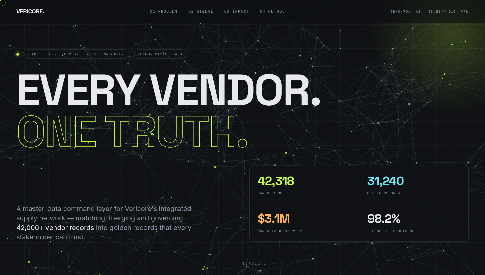
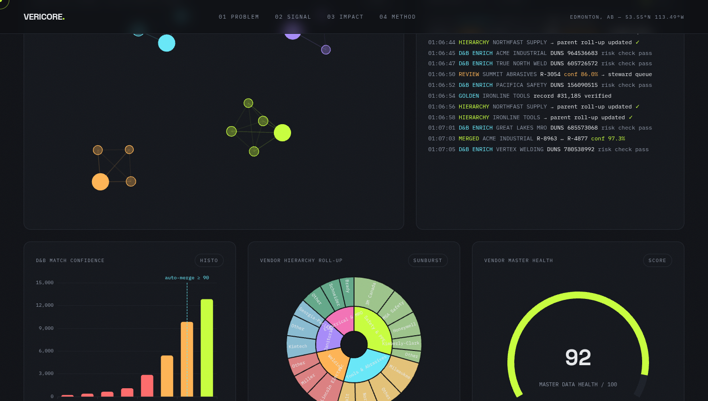
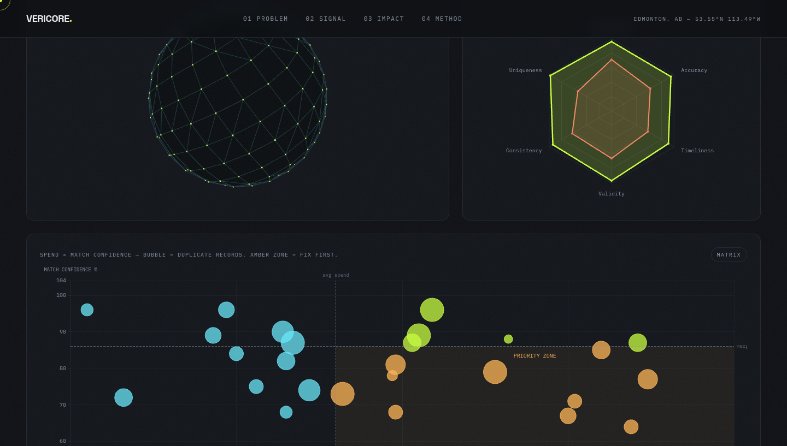
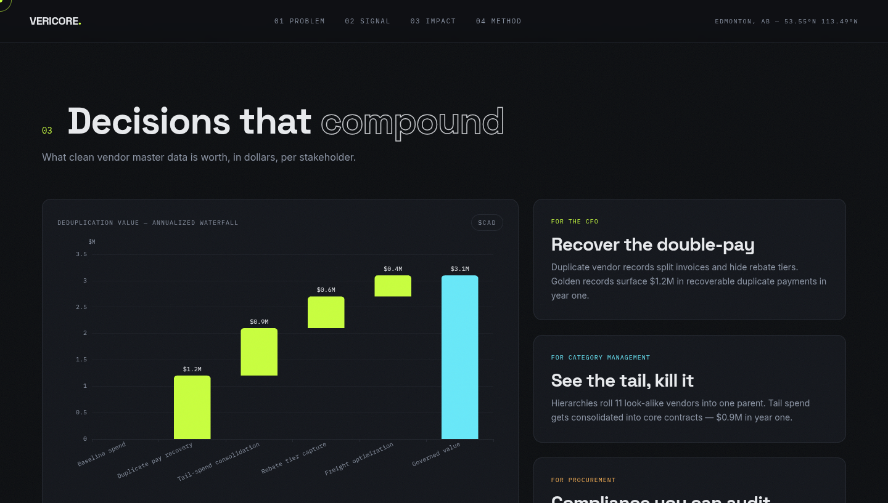

<p align="center"></p>

<h1 align="center">VERICORE</h1>
<p align="center"><b>Every vendor. One truth.</b><br>
Vendor master-data intelligence for industrial supply networks.</p>

<p align="center">
  
  
  
  
</p>

<p align="center"></p>

## 🏭 The company

**Vericore** embeds inside industrial supply networks and runs the one layer everything
else stands on: **a governed golden record for every vendor**. Built on **Stibo STEP**
master-data management, **D&B** enrichment and **Infor SX.e / AS/400** ERP integration,
Vericore turns fragmented supplier records into a decision-grade asset.

| | |
|---|---|
| 📍 HQ | Edmonton, AB, Canada — 53.55°N 113.49°W |
| 🧱 Stack | Stibo STEP (MDM) · D&B enrichment · Infor SX.e / AS/400 · e-Crib network |
| 🎯 Core metric | 42,318 raw records → **31,240 golden records** |
| 💚 Master-data health | **92 / 100** |
| 💰 Annualized recovery | **$3.1M** |
| 🔁 Method | **Ingest → Profile → Match → Merge → Govern** |

<p align="center"></p>

## 🧰 Services

| | Service | What it does |
|---|---|---|
| 🏗️ | **Integrated supply** | Vericore staff embedded on customer sites running the whole MRO supply chain |
| 📦 | **Vendor-managed inventory (VMI)** | On-site ordering & replenishment, owned by Vericore |
| 🔍 | **Customer-managed inventory (CMI)** | Customer keeps control; Vericore provides scan tools + governed data |
| 🗄️ | **Storeroom management** | One SaaS portal for storerooms, vending, VMI/CMI locations |
| 🎰 | **Point-of-use vending** | CabLock / AccuCab machines; every dispense tied to employee & cost center |
| 🛒 | **Digital procurement** | Tailored e-catalogs, authorization controls, rogue-spend blocking |
| 🦺 | **Safety services** | Inspection, testing, rentals, certification, training |
| 🖥️ | **e-Crib platform** | Proprietary web+mobile inventory backbone interfacing with customer ERP |

→ full detail in **[docs/services.md](docs/services.md)**

## 📦 Products

| | Product line |
|---|---|
| 🔩 | **MRO & safety supplies** — millions of SKUs: PPE (incl. women's PPE line), tools, abrasives, cutting, welding, janitorial |
| 🥽 | **Encon safety equipment** — own-manufactured protective clothing, eyewash/drench units, storage cabinets |
| 🤖 | **Vending hardware** — CabLock / AccuCab point-of-use machines |
| 🥇 | **Data products** — golden vendor records, hierarchy roll-ups, data-quality scorecards, match/merge feeds |

→ full detail in **[docs/products.md](docs/products.md)**

<p align="center"></p>

## ⚠️ Data pain points → ✅ solutions → 🎯 stakeholder decisions

| Pain point | Root cause | Solution | Decision it unlocks |
|---|---|---|---|
| 🌀 **Field drift** | One supplier = 14 name variants across SX.e branches | Standardization + survivorship rules in STEP | 🎯 **CFO/AP:** recover $1.2M in duplicate payments |
| 👥 **Duplicates** | Up to 11 records per vendor; no hierarchies | Deduplication + parent roll-ups | 🎯 **Category mgmt:** consolidate $0.9M tail spend |
| ❓ **Match ambiguity** | 27% of D&B candidates below auto-merge | Thresholded auto-merge + steward review queue | 🎯 **Procurement:** every merge auditable & defensible |
| 🕸️ **Site variance** | 160+ e-Crib storerooms never reconciling | Governed site feeds + nightly reconciliation | 🎯 **Operations:** targeted cleansing, one trusted vendor number |

→ full write-up in **[docs/pain-points.md](docs/pain-points.md)**

## 🛰️ The command center — live

**The repo is the demo.** The full interactive site is served straight from `docs/` —
15 visualizations, 2 WebGL 3D scenes, a live merge-resolution feed, and **charts that
talk to each other**:

> 🖱️ Click a **sunburst category** → the spend×confidence matrix and the Pareto re-filter.
> 🖱️ Click a **histogram bucket** → bubbles outside that D&B confidence range dim.
> 🖱️ Click a **Pareto bar** → that vendor isolates everywhere. A linked-filter chip tracks state.

| | | |
|---|---|---|
|  |  |  |
| Core dashboard — graph, terminal, histogram, sunburst, gauge | **3D supplier constellation** + radar + priority-zone matrix | Deduplication waterfall + stakeholder cards |

**Open it:**
- 📂 [`docs/index.html`](docs/index.html) — double-click, no build, no server
- 🌐 GitHub Pages: Settings → Pages → source **`/docs`** → `https://<you>.github.io/vericore/`
- 🚀 Or drag-and-drop the standalone file on [Netlify Drop](https://app.netlify.com/drop)

## 📊 Visualization gallery

What every visualization is **for** and what it **solves** — full guide in
**[docs/visualizations.md](docs/visualizations.md)**.

| # | Visualization | For | Solves |
|---|---|---|---|
| 1 | 🕸️ WebGL hero network (3D) | Mental model | Records are nodes; governance connects them |
| 2 | 🔗 Duplicate-cluster graph | Same vendor, many names | Finds the 11× before invoices split |
| 3 | 📟 Live merge terminal | Watch governance work | The audit trail auditors ask for |
| 4 | 📊 D&B confidence histogram | Where automation stops | Staffs the steward queue (27%) |
| 5 | 🌞 Hierarchy sunburst | Roll-up to parents | $4.2M concentration made visible |
| 6 | 💚 Health gauge (92/100) | One trust number | Every report inherits its credibility |
| 7 | 📈 Spend Pareto | 80/20 targeting | Who earns a negotiated contract |
| 8 | 🌊 Record-lifecycle Sankey | Raw → golden | Nothing disappears silently |
| 9 | 🗓️ Throughput area (24 wk) | Prove momentum | Governance compounds, not one-off |
| 10 | 🔥 Site × field heatmap | Target cleansing | Fix order, not guesswork |
| 11 | 🌐 Supplier constellation (3D) | Relationship space | Global context, occluded-depth 3D |
| 12 | 🎯 Quality radar | Maturity benchmark | Today vs post-governance gaps |
| 13 | 🫧 Spend × confidence matrix | Prioritize value × risk | Amber zone = fix-first list |
| 14 | 💵 Deduplication waterfall | The money | $3.1M annualized, decomposed |
| 15 | 🧭 Method timeline | Operating model | Repeatable 5-step lifecycle |

## 🗂️ Repo structure

```
vericore/
├── index.html                  # → redirect into docs/
├── docs/
│   ├── index.html              # THE SITE (self-contained, Pages-ready)
│   ├── services.md  products.md  pain-points.md  visualizations.md
├── assets/                     # rendered screenshots + animated SVG banner
└── README.md
```

## 🧪 Tech

`HTML · Tailwind CSS · ECharts 5 · Three.js r128 (WebGL) · GSAP + ScrollTrigger · Lenis smooth scroll`

<p align="center"></p>
<p align="center"><sub>VERICORE — vendor master-data intelligence · concept brand · EST. 2026</sub></p>
